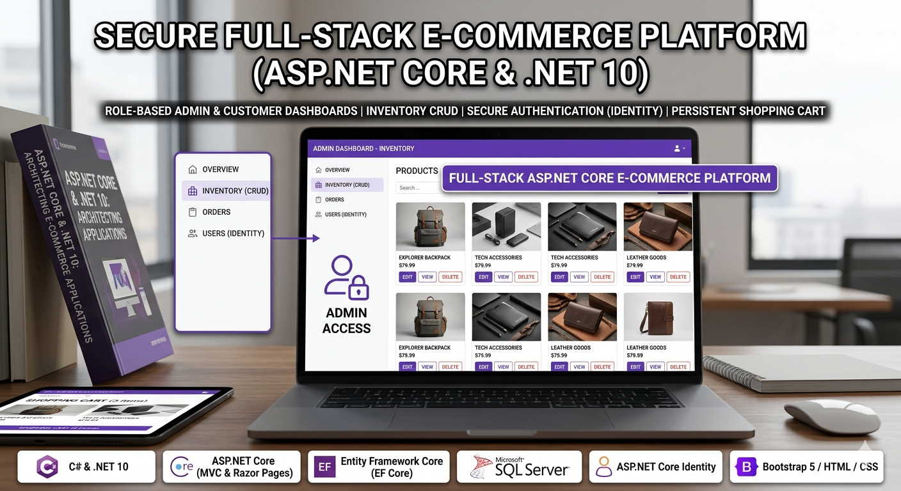

# .NET ASP E-Commerce Platform

<p align="center">
  
</p>

<p align="center">
  A modern ASP.NET Core e-commerce platform with product management, shopping cart, checkout flow, and authentication.
</p>

## Overview

This project is a full-stack e-commerce web application built with ASP.NET Core. It includes both client-facing shopping features and admin management pages, with a clean architecture around MVC/Razor, Entity Framework Core, and Identity-based authentication.

The goal is to provide a practical, real-world foundation for learning or extending an online store system in .NET.

## Key Features

- Product catalog browsing and details pages
- Category management
- Shopping cart (panier) management
- Checkout and order flow (commande)
- Authentication and user account support
- Admin area for back-office operations
- EF Core migrations and relational data model

## Tech Stack

- ASP.NET Core (.NET)
- C#
- Entity Framework Core
- ASP.NET Core Identity
- Razor Views / MVC pattern
- SQL database (via EF Core provider configured in appsettings)

## Project Structure

- myApp/Areas/Admin: Admin pages and management workflows
- myApp/Areas/Client: Client controllers, view models, and views
- myApp/Controllers: Application controllers
- myApp/Data: DbContext and migrations
- myApp/Models: Domain entities (products, cart, orders, users)
- myApp/Views and myApp/Pages: UI and Razor pages
- myApp/wwwroot: Static assets (CSS, JS, product images)

## Getting Started

### Prerequisites

- .NET SDK installed
- SQL Server (or configured database provider)
- Git

### Setup

1. Clone the repository.
2. Navigate to the project root.
3. Update connection strings in myApp/appsettings.json or myApp/appsettings.Development.json.
4. Apply EF Core migrations.
5. Run the application.

### Typical Commands

```bash
dotnet restore
dotnet build
dotnet ef database update --project myApp
dotnet run --project myApp
```

## Configuration Notes

- Keep secrets (passwords, API keys, connection strings) out of source control.
- Prefer environment variables or user secrets for sensitive configuration.
- Review launch profile settings in myApp/Properties/launchSettings.json.

## Warnings and Legal Notice

### Important Warning

This software is provided for educational and development purposes. Before using it in production, you are responsible for implementing and validating:

- Security hardening (authentication, authorization, input validation, logging, monitoring)
- Data protection and backup strategy
- Performance, scalability, and availability requirements
- Compliance with applicable laws and regulations

### Legal Disclaimer

- Provided "as is", without warranties of any kind, express or implied.
- The author is not liable for any damages, data loss, security incidents, or legal claims resulting from usage.
- You are solely responsible for how you deploy, modify, and use this code.
- Third-party libraries and frameworks remain subject to their own licenses.

### Compliance Reminder

If you process personal, payment, or customer data, ensure your usage complies with relevant privacy and commerce regulations in your jurisdiction.

## Contact

- Email: bmarachid@gmail.com
- GitHub: https://github.com/chidoxbma
- LinkedIn: https://www.linkedin.com/in/rachid-bouselama-346575248/

## Contributing

Contributions, suggestions, and improvements are welcome. Open an issue or submit a pull request with a clear description of your proposed change.
